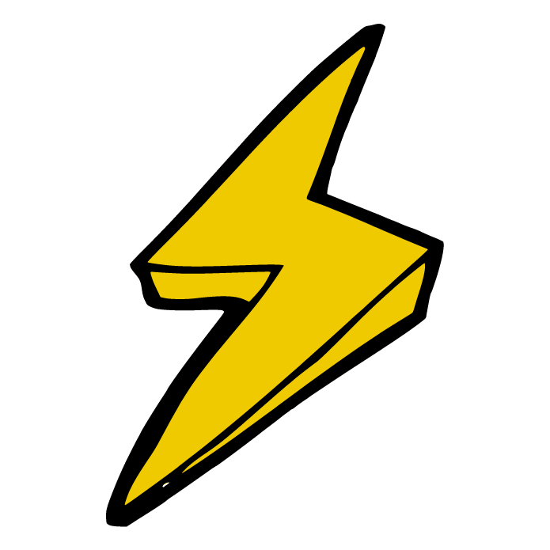
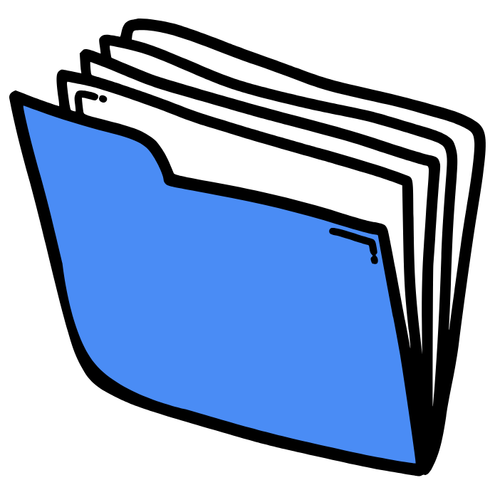
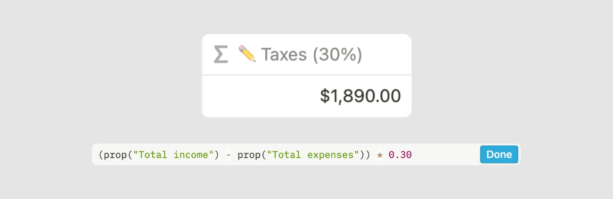

# Instructions

## Что это за пространство

**Small Business Space / Prod.Swaim** — готовый набор разделов для управления и развития **цифрового продукта** (и смежного малого бизнеса).

Он для вас, если:
- не хотите каждый раз искать «с чего начать» и собирать структуру с нуля;
- нужны готовые блоки под типовые ситуации (продукт, клиенты, бренд, задачи, маркетинг, финансы, знания);
- хотите вести всё сами **или** работать **в паре с ИИ**: проверять формулировки, усиливать решения, не отдавая контроль.

Он **не** заменяет CRM, бухгалтерию или менеджер паролей как единственную систему правды — это операционная оболочка и мышление продукта.

## Чем вдохновлено

Треки и формулировки опираются на практики product craft (не «цитатник» внутри каждого чеклиста):

- ценность и outcomes, discovery + delivery — Марти Каган, «Вдохновлённые»;
- гипотезы, Build-Measure-Learn, лимит параллельной работы — Эрик Рис, Lean Startup;
- честный сигнал от клиентов вместо вежливых мнений — Роберт Фитцпатрик, «Спроси маму»;
- быстрые проверки с людьми — Джейк Кнапп, «Спринт»;
- MVP = уже полезный (и по возможности платящий) срез продукта — Дэн Олсен и уточнение владельца шаблона.

В треках «Старт» / «Развитие» — действия и ссылки на разделы пространства. Книги выше — компас мышления, не обязательное чтение перед каждым шагом.

## Работа с ИИ (по желанию)

Шаблон рассчитан на работу **в Notion**. ИИ — напарник, не автопилот: финальные формулировки и решения оставляйте за собой.

Как удобно подключить ИИ к материалам пространства:

1. Ведите продукт в Notion как обычно (чеклисты, базы, заметки).
2. Если хотите разобрать раздел глубже с агентом — можно **скачать / открыть копию материалов** этого шаблона в среде, где работает ваш ИИ (например Cursor или аналог): подключить папку с файлами, попросить прочитать Instructions, «Твой продукт», нужный модуль и предложить правки.
3. Просите ИИ опираться на вопросы раздела и на принципы выше (гипотезы, Mom Test, MVP как ценный срез) — и **проверяйте** ответ: подходит ли он вашему сегменту и фактам с интервью.
4. Не отдавайте ИИ секреты: пароли, ключи API, персональные данные клиентов. Для паролей используйте отдельный менеджер (см. раздел «Пароли» в дополнительных материалах — он не ядро шаблона).

Знакомиться с полной файловой копией шаблона имеет смысл, если вы правите тексты пакетами, ведёте версионность или работаете с агентом над несколькими разделами сразу. Для ежедневной работы достаточно Notion.

## Как пользоваться

Каждый продукт отличается. Если что-то не подходит — отредактируйте, перестройте или удалите страницы. Это основа, а не догма: сделайте пространство своим.

Рекомендации:
- Страницы, которыми пользуетесь чаще всего, закрепите в избранном Notion / закладках / ярлыке.
- Удаляйте или архивируйте то, что не даёт ценности именно вашему продукту.
- Заполняйте документы своими ответами; чужие образцы смотрите только в помеченных **примерах**.
- С ИИ удобно разбирать «Бизнес» и «Быстрый старт», но не подменяйте проверку рынком генерацией текста.

## С чего начать

1. Прочитайте это окно инструкций.
2. Выберите трек в **Быстрый старт**: [«Старт своего бизнеса»](../Быстрый%20старт/Старт%20своего%20бизнеса--66c3ee00.md) или [«Развитие своего бизнеса»](../Быстрый%20старт/Развитие%20своего%20бизнеса--d23a7834.md).
3. Начните с раздела [Твой продукт](../Бизнес/Твой%20продукт--5ac1cda1.md) (чистый шаблон) — при необходимости сверьтесь с [примером заполнения](../examples/твой-продукт-пример.md).

## Типы страниц (Pages indications)

<aside>
 `Document` — заполните информацией о своём продукте / бизнесе.

</aside>

<aside>
 `Activity` — повседневная работа: заметки, задачи, календарь и т.п.

</aside>

<aside>
 `Database` — учёт контента, расходов, списков и связанных записей.

</aside>

<aside>
 `Archive` — вспомогательное, не ядро продукта.

</aside>

## Колонки в базах (Columns indications)

<aside>
⛔ `Not editable` — обычно формулы: считают или объединяют поля. Не затирайте без нужды. Ставки налогов и проценты в формулах **настраивайте под себя** (не оставляйте чужой дефолт).

- Пример:
    
    
    
</aside>

<aside>
✏️ `Editable` — поля, которые вы заполняете. Формулы подстраивайте под свою модель (налоги, метрики и т.д.).

- Пример:
    
    
    
</aside>

## Шаблоны записей (Templates indications)

В базах Notion часто есть **кнопка шаблона** новой записи (пост, задача, инвойс и т.д.).

- Используйте шаблон, чтобы не собирать поля каждый раз с нуля.
- После дублирования пространства удалите чужие демо-данные или пометьте их как «Пример».
- Записи вроде «Untitled» без смысла — удалите сразу, чтобы не засорять базу.
- Если шаблон записи мешает — упростите под свой ритуал работы (с ИИ или без).
