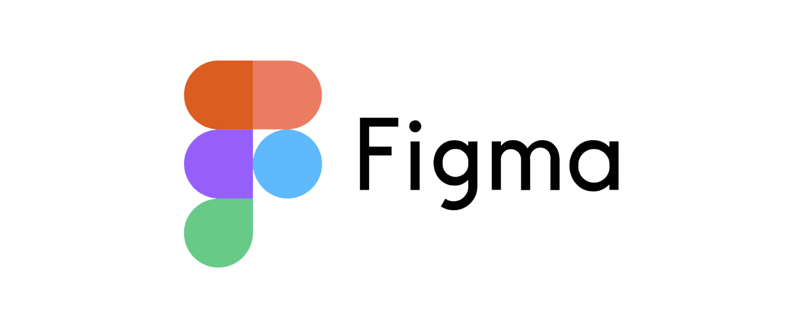

# Figma

Tools Categories: Design
Content: Figma is a design platform for teams who build products. Figma helps teams create, test, and ship better designs.
Image Featured: https://pathpages.com/wp-content/uploads/2021/08/tool-26.png
Link: https://www.figma.com

