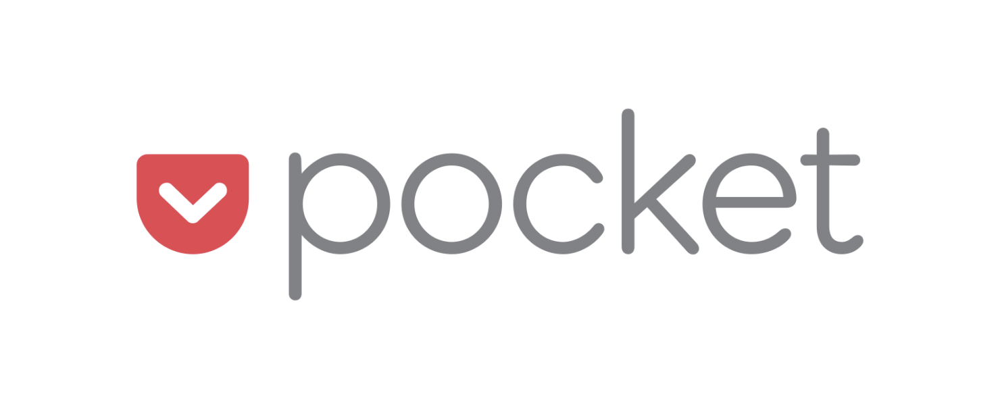

# Pocket

Tools Categories: Link Management
Content: Pocket, previously known as Read It Later, is an application for managing a reading list of articles and videos from the internet.
Image Featured: https://pathpages.com/wp-content/uploads/2021/08/tool-2.png
Link: https://getpocket.com

